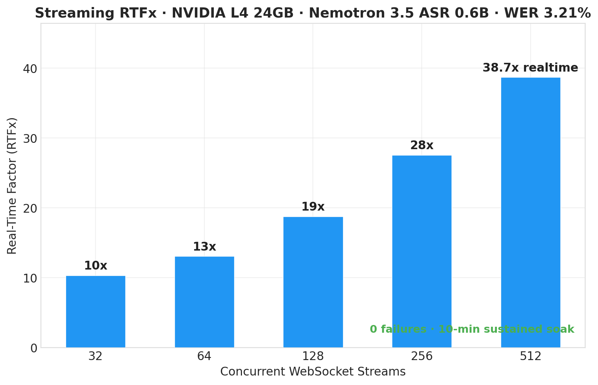
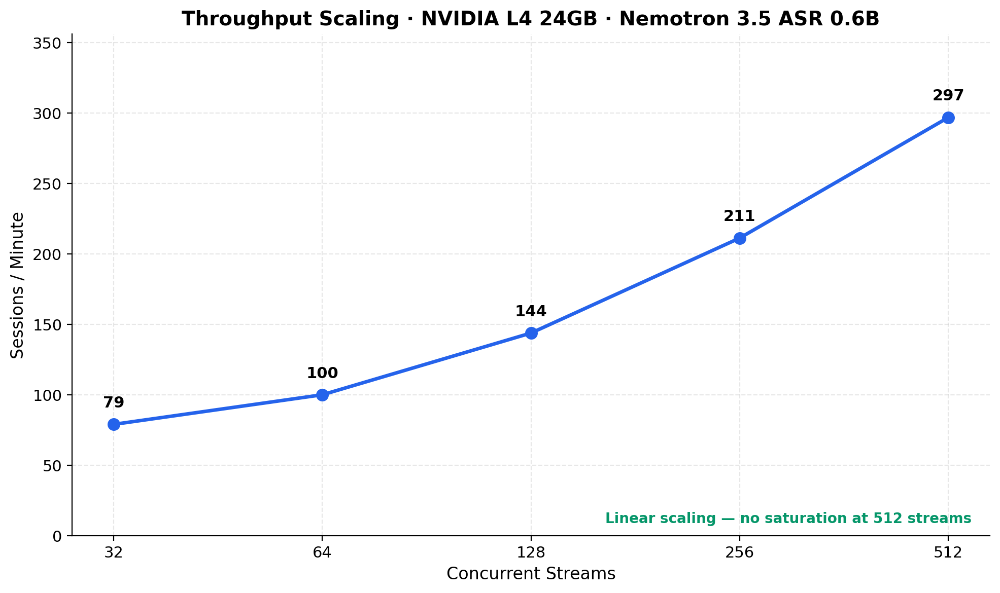
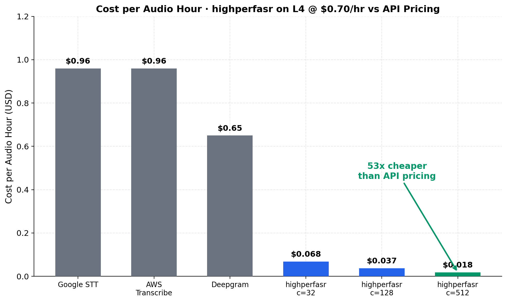
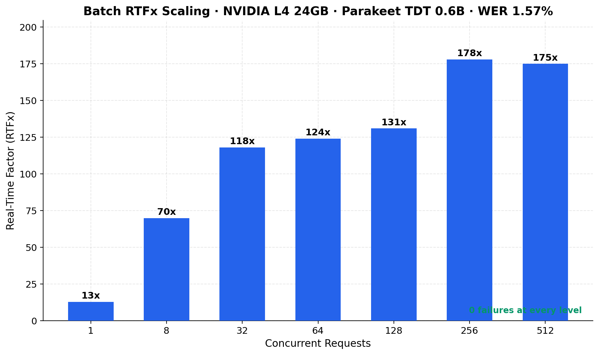
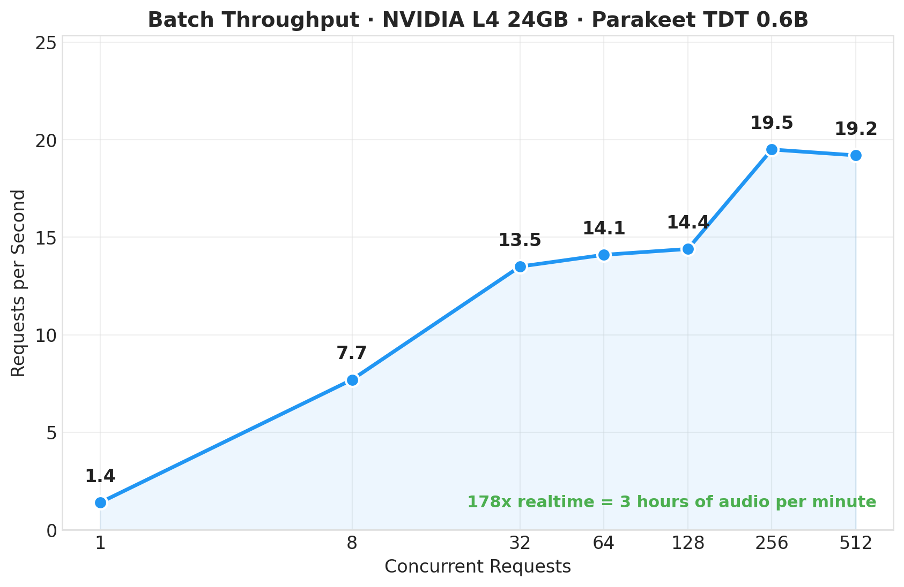
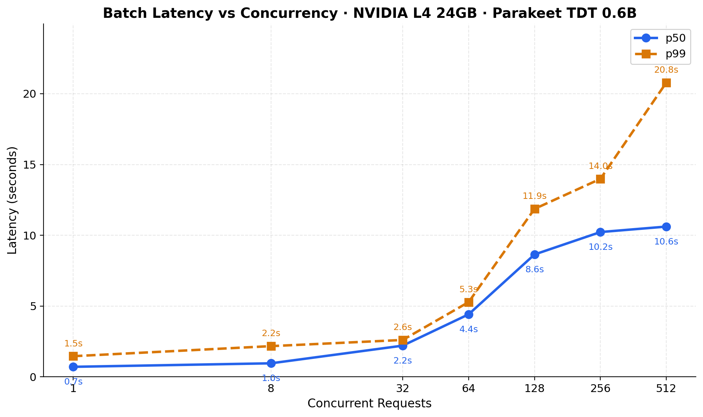
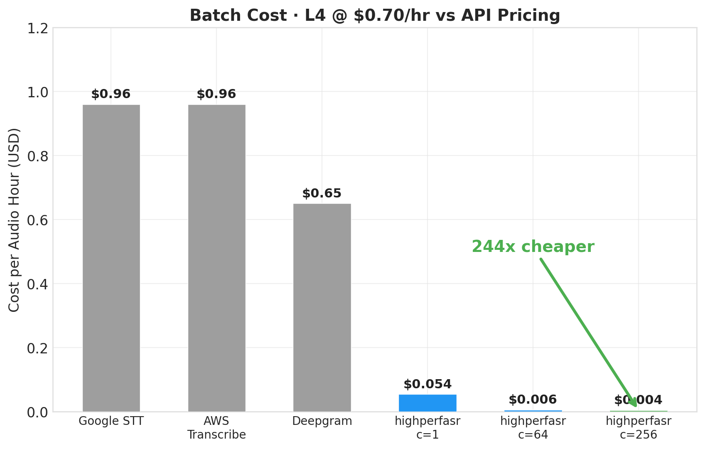

# highperfasr

Serving optimization for existing open-source ASR models.

highperfasr does not train models or change recognition quality. It tunes server configuration and patches framework bottlenecks to maximize throughput and concurrency while preserving the model's published WER.

Run batch and streaming transcription on a single GPU with a simple, framework-agnostic protocol:

- REST endpoint for file transcription
- WebSocket endpoint for real-time PCM16 streams
- Docker Compose for local GPU serving
- GKE L4 manifest for single-GPU deployment
- Published benchmarks with reproducible results

Measured on one GKE L4 GPU with model quality preserved:

| Workload | Result |
|----------|--------|
| Streaming concurrency | 512 WebSocket streams, 0 failures |
| Streaming quality | 3.21% WER on LibriSpeech test-clean |
| Streaming throughput | 297 sessions/min, 38.69x realtime |
| Batch throughput | 178x realtime, about 3 hours of audio per minute |
| Batch quality | 1.57% WER on LibriSpeech test-clean |
| Cost | About $0.70/hr on GKE L4 |

```bash
git clone https://github.com/beastoin/highperfasr
cd highperfasr
docker compose up -d
curl -F "file=@audio.wav" http://localhost:8000/v1/transcriptions
```

## Performance

### Streaming (Nemotron 3.5 ASR 0.6B)







512 persistent WebSocket streams, 10-minute real-time soak, all 2,620 LibriSpeech
test-clean files. WER 3.21%, 297 sessions/min, 8672 MB VRAM (38%), 0 failures.

Full report: [benchmarks/results/2026-l4-nemo-512-streams/](benchmarks/results/2026-l4-nemo-512-streams/)

### Batch (Parakeet TDT 0.6B)









REST concurrency sweep c=1..512, LibriSpeech test-clean (200 files).
WER 1.57%, peak 19.5 RPS (178x realtime), 0 failures at every level.

Full report: [benchmarks/results/2026-l4-nemo-batch/](benchmarks/results/2026-l4-nemo-batch/)

### Methodology

Quality rubric: real speech corpus, standard WER normalization (Whisper
EnglishTextNormalizer), sustained concurrent load, reproducible artifacts.
Verify: [report schema](benchmarks/report-schema.json),
[streaming result.json](benchmarks/results/2026-l4-nemo-512-streams/result.json),
[batch result.json](benchmarks/results/2026-l4-nemo-batch/result.json).

## Deploy

Prerequisites: Docker, NVIDIA Container Toolkit, and a CUDA-capable GPU. The
first run downloads the ASR models and caches them in Docker volumes.

| Command | What |
|---------|------|
| `docker compose up -d` | Start streaming only (:8001) — default for 1 GPU |
| `docker compose --profile full up -d` | Start batch (:8000) + streaming (:8001) — requires 2 GPUs |
| `docker compose up -d batch` | Start batch only (:8000) |
| `make health` | Check server readiness |
| `make smoke` | Run a quick transcription test |
| `curl http://localhost:8001/metrics/prometheus` | Prometheus metrics |
| `docker compose logs -f` | Tail server logs |

### Model Caching

Models download from HuggingFace on first run (~2 GB each). They are cached in
named Docker volumes (`model-cache-batch`, `model-cache-stream`) which persist
across `docker compose down` but not `docker compose down -v`.

Pre-fetch models without starting the server:

```bash
docker compose run --rm stream python -c \
  "from nemo.collections.asr.models import ASRModel; ASRModel.from_pretrained('nvidia/parakeet-tdt-0.6b-v2')"
```

The `HF_HOME` environment variable controls the cache location (default:
`/app/.cache/huggingface` inside the container). For air-gapped deployments,
copy a populated cache volume to the target host.

GKE: PersistentVolumeClaims are already configured in `gke-l4.yaml`. First pod
startup takes 2-3 minutes for the download; subsequent starts use the cached model.

### GKE L4

```bash
docker build --target stream -t $REGISTRY/highperfasr-stream:v0.1.0 .
docker push $REGISTRY/highperfasr-stream:v0.1.0
kubectl apply -f gke-l4.yaml
```

### Client Examples

See [examples/](examples/) for Python and Node.js integration examples.

## Protocol (v1alpha1, draft)

highperfasr uses a framework-agnostic protocol: REST for files, WebSocket for
live audio, and health checks for orchestration.

| Endpoint | Mode | Input |
|----------|------|-------|
| `POST /v1/transcriptions` | Batch | Multipart file upload |
| `WebSocket /v1/stream` | Streaming | Raw PCM16 audio frames |
| `GET /health` | Health | Readiness and server mode |

Full spec: [spec/protocol.md](spec/protocol.md) | [OpenAPI](spec/openapi.yaml) | [AsyncAPI](spec/asyncapi.yaml)

## Structure

```text
Dockerfile           # multi-target image: batch + stream
compose.yaml         # docker compose up -d
gke-l4.yaml          # GKE L4 GPU deployment
labs/nemo-fastapi/   # NeMo serving + framework patches (fork: github.com/beastoin/NeMo)
examples/            # Python + Node.js client examples
spec/                # REST + WebSocket protocol
benchmarks/scripts/  # reproducible benchmark scripts (batch, streaming, WER)
benchmarks/results/  # published benchmark reports (JSON + markdown)
```

## NeMo Fork

The Dockerfile builds from [beastoin/NeMo](https://github.com/beastoin/NeMo),
pinned to a specific commit SHA for reproducible builds. The fork carries
patches not yet merged upstream:

1. Thread-safety fix for `freeze()`/`unfreeze()` race in multi-threaded serving
2. Pinned-memory cross-thread GC segfault fix
3. Cache-aware streaming RNNT pipeline support
4. `num_slots` pipeline parameter for concurrent stream limits
5. `max_stream_drain` limit to prevent VRAM explosion

To update the pin: check the fork's HEAD with
`git ls-remote https://github.com/beastoin/NeMo.git refs/heads/main`,
then update `NEMO_FORK_REF` in the Dockerfile.

## Q&A

| Question | Batch (Parakeet TDT 0.6B v3) | Streaming (Nemotron 3.5 ASR 0.6B) |
|----------|------|-----------|
| What languages are supported? | 25 European languages, auto-detect | 36 languages / 40 locales, auto-detect |
| Punctuation & capitalization? | Yes | Yes |
| Word-level timestamps? | Yes | Partial transcripts (real-time) |
| Maximum audio length? | 24 min (full attention), 3 hr (local attention) | Indefinite (persistent WebSocket) |
| Speaker diarization? | Roadmap | Roadmap |
| Inverse text normalization (ITN)? | Roadmap | Roadmap |

**Languages — Batch:** bg, cs, da, de, el, en, es, et, fi, fr, hr, hu, it, lt,
lv, mt, nl, pl, pt, ro, ru, sk, sl, sv, uk (25 European).
**Languages — Streaming:** all batch languages plus ar, ja, ko, zh, hi, th, and
14 more locales (40 total). Set `target_lang` in config or use `auto`.

## Users & Sponsors

- **[Omi](https://omi.me)** uses highperfasr in production for an AI wearable
  workload with thousands of concurrent streams. Omi also sponsors the GPU
  benchmark work published in this repository.

## Mission

Speech recognition infrastructure should be something teams can run, measure,
and control.

highperfasr exists to help companies keep audio inside their own pipeline, on
their own infrastructure, without depending on third-party ASR APIs.

## License

MIT
